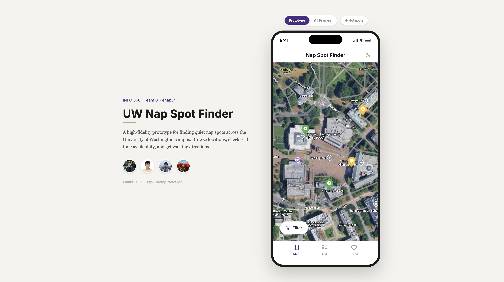

# UW Nap Spot Finder

A high-fidelity interactive prototype for finding quiet nap spots across the University of Washington campus. Built for INFO 360: Design Methods, taught by Lindah Kotut at UW.

[](https://info360.joechamdani.com)
[](https://www.youtube.com/watch?v=HGUOwM9aqSw)

## Preview



[](https://info360.joechamdani.com)

## Demo Video

[](https://www.youtube.com/watch?v=HGUOwM9aqSw)

[](https://www.youtube.com/watch?v=HGUOwM9aqSw)

## Features

- Interactive campus map with real-time spot availability
- Filter spots by noise level, seating type, walk time, and availability
- Spot details with photos, amenities, and crowd status
- Save favorite spots for quick access
- Walking directions with animated route visualization
- Arrival check-in with noise level and occupancy reporting
- Responsive phone frame that scales to any screen size
- Static frames view showing all 9 screens at a glance
- Hotspot toggle to highlight all interactive elements

## Tech Stack

- **React 18** with TypeScript
- **React Router v7** for client-side routing
- **Tailwind CSS v4** for styling
- **Motion** (Framer Motion) for page transitions and animations
- **Sonner** for toast notifications
- **Lucide React** for icons
- **Vite** for build tooling

## Getting Started

```bash
pnpm install
pnpm dev
```

## Project Structure

```
src/
  app/
    App.tsx              # Main layout, phone frame, routing
    StaticFrames.tsx     # All 9 screens rendered as static frames
    types.ts             # Data models and mock data
    components/
      layout.tsx         # StatusBar, TopBar, BottomNav
      map-overlays.tsx   # MapMarker, BottomSheet, FilterModal
      PageTransition.tsx # Animated page transitions
      ui.tsx             # Shared UI components
      ui/sonner.tsx      # Toast notification config
    context/
      AppContext.tsx      # Global state (saved spots, filters)
    screens/
      HomeMap.tsx         # Map view with markers
      ListSpots.tsx       # List view of all spots
      SavedSpots.tsx      # Saved spots screen
      SpotDetails.tsx     # Spot detail page
      BrowseSpots.tsx     # Browse/search spots
      Directions.tsx      # Walking directions with route
      Arrived.tsx         # Arrival check-in and rating
  styles/
    theme.css            # Design tokens and base styles
    index.css            # Entry point
    tailwind.css         # Tailwind imports
    fonts.css            # Font configuration
public/
  assets/                # App assets (map, icons)
  team/                  # Team member photos
```

## Team

**Team B-Penabur** — INFO 360: Design Methods, Winter 2026

| | Name | GitHub |
|---|---|---|
|  | **Joseph Davis Chamdani** | [@JosephDavisC](https://github.com/JosephDavisC) |
|  | **Kenneth Wu** | [@kennethwu30](https://github.com/kennethwu30) |
|  | **Kenneth Pangestu** | [@kennethpangestu](https://github.com/kennethpangestu) |
|  | **Winson Teh** | [@win719](https://github.com/win719) |

## License

This project was created for educational purposes as part of the University of Washington's INFO 360: Design Methods course, taught by Lindah Kotut.
